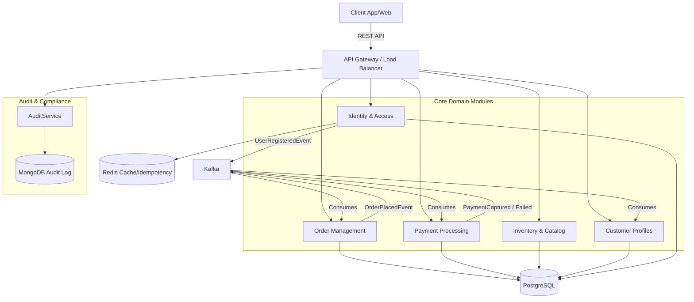

# 🛒 Mini Market SaaS System


## 🌟 Overview

**Mini Market SaaS** is an enterprise-grade, **Event-Driven E-Commerce Platform** built with **Spring Boot** and **Kafka**. It adheres to **Domain-Driven Design (DDD)**, **SOLID** principles, and **12-Factor App** methodology.

Unlike simple CRUD applications, this system implements complex distributed patterns like **Saga Choreography** for data consistency across microservices (logic modules) and **Asynchronous Event Processing** for high performance.

---

## 🚀 Key Features

### 📡 Event-Driven Architecture (EDA)
- **Saga Choreography**: Orders and Payments are fully decoupled. Transactional consistency is maintained via eventual consistency patterns.
  - `OrderPlacedEvent` -> Triggers Payment Processing.
  - `PaymentCapturedEvent` -> Triggers Order Completion.
  - `PaymentFailedEvent` -> Triggers Order Cancellation (Compensating Transaction).
- **Async Customer Onboarding**: User registration triggers `UserRegisteredEvent`, which asynchronously creates customer profiles and performs KYC checks.

### 🛡️ Advanced Security & Identity
- **Stateless Authentication**: JWT (JSON Web Tokens) with Access and Refresh Token rotation.
- **Multi-Factor Authentication (MFA)**: Mandatory 2FA using Time-based One-Time Passwords (TOTP) compatible with Google Authenticator/Authy.
- **Recovery Codes**: Secure backup codes for account recovery.
- **Role-Based Access Control (RBAC)**: Fine-grained permissions for Customers and Admins.

### 💎 Domain-Driven Design (DDD)
- **Rich Domain Models**: Business logic encapsulated in entities (e.g., `Order.applyCoupon()`, `Money.subtract()`).
- **Value Objects**: Immutable objects like `Money` ensuring type safety and logic centralization.
- **Separation of Concerns**: Strict boundary between API (Controllers), Application (Services), Domain (Entities), and Infrastructure (Repositories/External Adapters).

### ⚡ Resilience & Compliance
- **Rate Limiting**: API protection using **Resilience4j** (Token Bucket algorithm) to prevent abuse.
- **Audit Logging**: Asynchronous, non-blocking audit trails stored in **MongoDB** for compliance.
- **Idempotency**: Redis-backed idempotency keys to prevent duplicate transaction processing.
- **KYC Verification**: Dedicated flow for Know Your Customer (KYC) compliance.

---

## 🏗️ Architecture



---

## 🛠️ Technology Stack

| Category | Technology | Usage |
| :--- | :--- | :--- |
| **Language** | Java 17 | Core programming language |
| **Framework** | Spring Boot 3.3 | App framework (Web, Data, Security) |
| **Messaging** | Apache Kafka | Event bus for async communication |
| **Database** | PostgreSQL | Primary relational database |
| **NoSQL** | MongoDB | High-volume audit logging |
| **Caching** | Redis | Caching, Idempotency, Session store |
| **Security** | Spring Security | AuthZ/AuthN, OAuth2 Resource Server |
| **Resilience** | Resilience4j | Circuit Breakers, Rate Limiters |
| **Build Tool** | Maven | Dependency management |
| **Container** | Docker | Containerization & Orchestration |

---

## 🏁 Getting Started

### Prerequisites
- **Java 17+**
- **Docker Desktop** (or Docker Engine + Compose)
- **Maven** (optional, wrapper included)

### 1. Clone the Repository
```bash
git clone https://github.com/vanilson/mini-market-system.git
cd mini-market-system
```

### 2. Build the Application
```bash
./mvnw clean package -DskipTests
```

### 3. Start Infrastructure & App
Use Docker Compose to start the database, brokers, and the application container.
```bash
docker-compose up -d --build
```
> **Note**: The application will be available at `http://localhost:8080`.
> - **Swagger UI**: `http://localhost:8080/swagger-ui.html`
> - **Prometheus**: `http://localhost:9090`
> - **Grafana**: `http://localhost:3000`

---

## 📚 API Documentation

The API is fully documented using **OpenAPI 3.0 (Swagger)**.

### Key Endpoints

#### 🔐 Authentication
- `POST /api/auth/register` - Register new user (triggers async Customer creation).
- `POST /api/auth/login` - Login and receive JWT.
- `POST /api/auth/2fa/verify` - Verify TOTP code.

#### 🛒 Orders & Payments
- `POST /api/orders` - Place a new order (starts Saga).
- `POST /api/payments/refund/{orderId}` - Administration refund.
- `GET /api/orders/{id}` - Get order status.

#### 👥 Customers
- `POST /api/customers/{id}/kyc` - Verify Customer Identity.
- `GET /api/customers/me` - Get profile.

---

## 🧪 Testing

Run unit and integration tests:
```bash
./mvnw test
```

For compliance checks:
```bash
./mvnw clean package
```

---

## 📜 License
This project is licensed under the **MIT License**.

---
*Built with ❤️ for High-Scale SaaS Architecture.*
