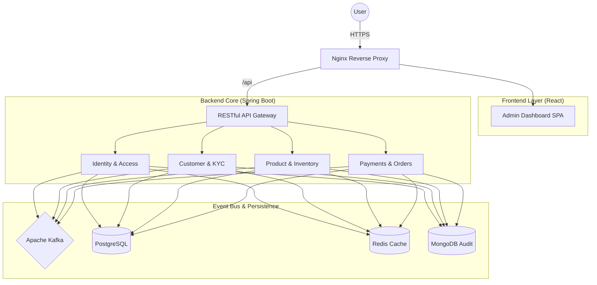

# 🛒 Mini Market Full-Stack SaaS Ecosystem

[](https://jdk.java.net/17/)
[](https://spring.io/projects/spring-boot)
[](https://reactjs.org/)
[](https://www.typescriptlang.org/)
[](https://tailwindcss.com/)
[](https://kafka.apache.org/)
[](https://www.docker.com/)

## 🌟 Overview

**Mini Market SaaS** is a comprehensive, production-ready **Full-Stack E-Commerce Platform**. It features a modern **React Dashboard** integrated with a high-scale, **Event-Driven Backend** built on **Spring Boot** and **Apache Kafka**. 

This ecosystem is designed for **Multi-Tenancy**, utilizing **Domain-Driven Design (DDD)** and **Saga Choreography** to ensure strict data isolation and eventual consistency across distributed services.

---

## 🏗️ System Architecture

The ecosystem utilizes a **Clean Architecture** approach with a dedicated **Reverse Proxy** (Nginx) to bridge the frontend and backend.



---

## 🚀 Key Modules

### 🎨 Modern Frontend Dashboard
- **Tech Stack**: React 18, TypeScript, Tailwind CSS, Vite.
- **State Management**: TanStack Query (React Query) for server state and Zustand for local state.
- **Security**: HttpOnly Cookie / JWT Storage with automatic token rotation.
- **Components**: Shadcn/UI for a premium, accessible user interface.

### 📡 Event-Driven Backend
- **Saga Patterns**: Decoupled order/payment flows using Kafka-based asynchronous messaging.
- **Multi-Tenancy**: Logical data isolation across all domains via `tenantId` scoping.
- **IAM & 2FA**: Advanced Identity and Access Management with TOTP (TOTP) and recovery codes.
- **Observability**: Integrated Prometheus & Grafana for real-time performance monitoring.

---

## 🛠️ Full-Stack Technology Stack

| Layer | Technologies |
| :--- | :--- |
| **Frontend** | React, TypeScript, Tailwind CSS, Vite, TanStack Query |
| **Backend** | Java 17, Spring Boot 3.3, Spring Security |
| **Broker** | Apache Kafka (Event Streaming) |
| **Databases** | PostgreSQL (Relational), MongoDB (Audit), Redis (Cache) |
| **Orchestration**| Docker, Docker Compose, Nginx |
| **CI/CD** | GitHub Actions (Maven-CI, Frontend-CI) |

---

## 🏁 Getting Started (Docker Orchestration)

The entire ecosystem is containerized for seamless local development and deployment.

### 1. Build and Launch
Ensure you have **Docker Desktop** installed.
```bash
docker-compose up -d --build
```

### 2. Access Points
- **Frontend Dashboard**: [http://localhost](http://localhost) (Nginx managed)
- **API Specification**: [http://localhost:8080/swagger-ui.html](http://localhost:8080/swagger-ui.html)
- **Monitoring Hub**:
  - Prometheus: [http://localhost:9090](http://localhost:9090)
  - Grafana: [http://localhost:3000](http://localhost:3000)
- **Mail Preview**: [http://localhost:8025](http://localhost:8025) (Mailhog)

---

## 📚 API Documentation

The platform exposes a comprehensive **OpenAPI 3.1** specification. Each endpoint is documented with:
- **Authorization**: Bearer JWT support.
- **Schemas**: Full DTO definitions with example values.
- **Security**: Explicit response codes for AuthZ/AuthN failures.

---

## 📜 License
Licensed under the **MIT License**.

---
*Enterprise-Grade SaaS Architecture, Built for Performance.*
